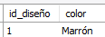

# Taller de Bases de Datos II

### Universidad Industrial de Santander

**Estudiantes:**

- Bryan Andrey Silva Vergel - 2221102
- Daniel Andrés Pinto Ortega - 2190558

**Asignatura:**

- Bases de Datos II

---

Este documento contiene las respuestas al taller proporcionado por la asignatura de Bases de Datos II. Los ejercicios están basados en el caso de estudio "Empresa de Zapatos", y se desarrollan a través del modelado de entidades, creación de bases de datos SQL y consultas específicas.

---

### Actividades:

1. La descripción generada por el ingeniero de requerimientos no especifica las propiedades de muchos componentes de la cadena de producción del zapato. Realice un modelo entidad relación y adicione las propiedades que considere necesarias.

---

A continuación, se muestra el código SQL correspondiente a la creación de las tablas necesarias:

```sql
-- Crear las tablas principales sin dependencias
-- Tabla Dirección
CREATE TABLE
  direccion (
    id_direccion INT AUTO_INCREMENT PRIMARY KEY,
    calle VARCHAR(100) NOT NULL,
    carrera VARCHAR(100) NOT NULL,
    numero INT NOT NULL,
    tipo_domicilio ENUM ('casa', 'apto', 'otro') NOT NULL,
    piso INT,
    apto INT
  );

-- Tabla Empleado (esta tabla es fundamental y la utilizaremos en otras tablas)
CREATE TABLE
  empleado (
    id_empleado INT AUTO_INCREMENT PRIMARY KEY,
    nombre VARCHAR(100) NOT NULL,
    edad INT NOT NULL,
    telefono VARCHAR(15),
    genero ENUM ('masculino', 'femenino', 'otro') NOT NULL,
    fecha_nacimiento DATE NOT NULL,
    id_direccion INT,
    tipo_empleado ENUM ('cortador', 'maestro_zapatero', 'ayudante') NOT NULL,
    fecha_contratacion DATE NOT NULL,
    FOREIGN KEY (id_direccion) REFERENCES direccion (id_direccion) ON DELETE SET NULL
  );

-- Tabla Lote
CREATE TABLE
  lote (
    codigo_lote INT AUTO_INCREMENT PRIMARY KEY,
    fecha_agotamiento DATE NOT NULL,
    fecha_recepcion DATE NOT NULL,
    valor_lote DECIMAL(10, 2) NOT NULL
  );

-- Tabla Material
CREATE TABLE
  material (
    codigo_material INT AUTO_INCREMENT PRIMARY KEY,
    nombre_material VARCHAR(100) NOT NULL,
    valor_material DECIMAL(10, 2) NOT NULL,
    fabricante VARCHAR(100) NOT NULL
  );

-- Tablas dependientes de Empleado
-- Tabla Cortador
CREATE TABLE
  cortador (
    id_empleado INT PRIMARY KEY,
    experiencia INT NOT NULL,
    FOREIGN KEY (id_empleado) REFERENCES empleado (id_empleado) ON DELETE CASCADE
  );

-- Tabla Maestro_Zapatero
CREATE TABLE
  maestro_zapatero (
    id_empleado INT PRIMARY KEY,
    especialidad VARCHAR(100) NOT NULL,
    FOREIGN KEY (id_empleado) REFERENCES empleado (id_empleado) ON DELETE CASCADE
  );

-- Tabla Ayudante
CREATE TABLE
  ayudante (
    id_empleado INT PRIMARY KEY,
    horas_trabajadas INT NOT NULL,
    FOREIGN KEY (id_empleado) REFERENCES empleado (id_empleado) ON DELETE CASCADE
  );

-- Crear las tablas relacionadas con los productos (zapatos, accesorios, etc.)
-- Tabla Tipo_Zapato
CREATE TABLE
  tipo_zapato (
    id_tipo_zapato INT AUTO_INCREMENT PRIMARY KEY,
    nombre VARCHAR(100)
  );

-- Tabla Diseño
CREATE TABLE diseño (
    id_diseño INT AUTO_INCREMENT PRIMARY KEY,
    id_tipo_zapato INT,
    color VARCHAR(50) NOT NULL,
    FOREIGN KEY (id_tipo_zapato) REFERENCES tipo_zapato (id_tipo_zapato) ON DELETE SET NULL
);


-- creadores del diseño  
CREATE TABLE
  zapatero_diseño (
    id INT AUTO_INCREMENT PRIMARY KEY,
    id_empleado INT,
    id_diseño INT,
    FOREIGN KEY (id_empleado) REFERENCES maestro_zapatero (id_empleado) ON DELETE CASCADE,
    FOREIGN KEY (id_diseño) REFERENCES diseño (id_diseño) ON DELETE CASCADE
  );

-- Tabla Molde
CREATE TABLE
  molde (
    id_molde INT AUTO_INCREMENT PRIMARY KEY,
    fabricante VARCHAR(100) NOT NULL,
    forma VARCHAR(100) NOT NULL,
    talla VARCHAR(50) NOT NULL
  );

-- Tabla Lote_Zapatos
CREATE TABLE
  lote_zapatos (
    codigo_lz INT AUTO_INCREMENT PRIMARY KEY,
    tiempo_estimado INT NOT NULL,
    numero_zapatos_fabricados INT NOT NULL,
    id_molde INT,
    FOREIGN KEY (id_molde) REFERENCES molde (id_molde) ON DELETE SET NULL ON UPDATE CASCADE
  );

-- Tabla Suela
CREATE TABLE
  suela (
    id_suela INT AUTO_INCREMENT PRIMARY KEY,
    color VARCHAR(50) NOT NULL,
    fabricante VARCHAR(100) NOT NULL,
    id_ayudante INT,
    FOREIGN KEY (id_ayudante) REFERENCES ayudante (id_empleado)
  );

-- Tabla Trozo
CREATE TABLE
  trozo (
    id_trozo INT AUTO_INCREMENT PRIMARY KEY,
    color VARCHAR(50) NOT NULL,
    codigo_material INT,
    id_cortador INT NOT NULL,
    FOREIGN KEY (codigo_material) REFERENCES material (codigo_material),
    FOREIGN KEY (id_cortador) REFERENCES cortador (id_empleado)
  );

-- tabla diseño_trozo
CREATE TABLE
  diseño_trozo (
    id INT AUTO_INCREMENT PRIMARY KEY,
    id_diseño INT,
    numero_trozo INT NOT NULL,
    id_material INT,
    FOREIGN KEY (id_diseño) REFERENCES diseño (id_diseño) ON DELETE CASCADE,
    FOREIGN KEY (id_material) REFERENCES material (codigo_material)
  );

-- Tabla Zapato (relaciona varios componentes como trozo, suela, etc.)
CREATE TABLE
  zapato (
    codigo_zapato INT AUTO_INCREMENT PRIMARY KEY,
    id_diseño INT,
    codigo_lz INT,
    id_suela INT,
    FOREIGN KEY (id_diseño) REFERENCES diseño (id_diseño) ON DELETE SET NULL,
    FOREIGN KEY (codigo_lz) REFERENCES lote_zapatos (codigo_lz) ON DELETE SET NULL,
    FOREIGN KEY (id_suela) REFERENCES suela (id_suela) ON DELETE SET NULL
  );

-- Crear la tabla trozo_zapato
CREATE TABLE
  trozo_zapato (
    id INT AUTO_INCREMENT PRIMARY KEY,
    id_zapato INT NOT NULL,
    id_trozo INT NOT NULL,
    FOREIGN KEY (id_zapato) REFERENCES zapato (codigo_zapato) ON DELETE CASCADE ON UPDATE CASCADE,
    FOREIGN KEY (id_trozo) REFERENCES trozo (id_trozo) ON DELETE CASCADE ON UPDATE CASCADE
  );

-- Crear tablas accesorias y de relación
-- Tabla Tipo_Accesorio
CREATE TABLE
  tipo_accesorio (
    id_accesorio INT AUTO_INCREMENT PRIMARY KEY,
    nombre VARCHAR(100) NOT NULL,
    material_accesorio VARCHAR(100) NOT NULL,
    color VARCHAR(50)
  );

-- Tabla Accesorio
CREATE TABLE
  accesorio (
    codigo_accesorio INT AUTO_INCREMENT PRIMARY KEY,
    fabricante VARCHAR(100) NOT NULL,
    valor DECIMAL(10, 2) NOT NULL,
    id_accesorio INT,
    FOREIGN KEY (id_accesorio) REFERENCES tipo_accesorio (id_accesorio) ON DELETE CASCADE
  );

CREATE TABLE
  diseño_accesorio (
    id INT AUTO_INCREMENT PRIMARY KEY,
    id_accesorio INT,
    id_diseño INT,
    FOREIGN KEY (id_accesorio) REFERENCES accesorio (codigo_accesorio),
    FOREIGN KEY (id_diseño) REFERENCES diseño (id_diseño)
  );

-- Tabla Accesorio_Zapato
CREATE TABLE
  accesorio_zapato (
    codigo_zapato INT,
    codigo_accesorio INT,
    PRIMARY KEY (codigo_zapato, codigo_accesorio),
    FOREIGN KEY (codigo_zapato) REFERENCES zapato (codigo_zapato) ON DELETE CASCADE,
    FOREIGN KEY (codigo_accesorio) REFERENCES accesorio (codigo_accesorio)
  );

-- Tabla Material_Lote (relaciona materiales con lotes)
CREATE TABLE
  material_lote (
    codigo_material INT AUTO_INCREMENT,
    codigo_lote INT,
    PRIMARY KEY (codigo_material, codigo_lote),
    FOREIGN KEY (codigo_material) REFERENCES material (codigo_material),
    FOREIGN KEY (codigo_lote) REFERENCES lote (codigo_lote)
  );

-- Tabla Molde_Lote (relaciona moldes con lotes)
CREATE TABLE
  molde_lote (
    id_molde INT,
    codigo_lote INT,
    PRIMARY KEY (id_molde, codigo_lote),
    FOREIGN KEY (id_molde) REFERENCES molde (id_molde),
    FOREIGN KEY (codigo_lote) REFERENCES lote (codigo_lote)
  );

-- Tabla Suelas_Lote
CREATE TABLE
  suelas_lote (
    id_suela INT,
    codigo_lote INT,
    PRIMARY KEY (id_suela, codigo_lote),
    FOREIGN KEY (id_suela) REFERENCES suela (id_suela),
    FOREIGN KEY (codigo_lote) REFERENCES lote (codigo_lote)
  );

-- Tabla Accesorios_Lote
CREATE TABLE
  accesorios_lote (
    codigo_accesorio INT,
    codigo_lote INT,
    PRIMARY KEY (codigo_accesorio, codigo_lote),
    FOREIGN KEY (codigo_accesorio) REFERENCES accesorio (codigo_accesorio),
    FOREIGN KEY (codigo_lote) REFERENCES lote (codigo_lote)
  );

-- Tabla Maestro_LZ (relaciona maestros zapateros con lote de zapatos)
CREATE TABLE
  maestro_lz (
    codigo_lz INT,
    id_zapatero INT,
    PRIMARY KEY (codigo_lz, id_zapatero),
    FOREIGN KEY (codigo_lz) REFERENCES lote_zapatos (codigo_lz) ON DELETE CASCADE,
    FOREIGN KEY (id_zapatero) REFERENCES maestro_zapatero (id_empleado)
  );

-- Tabla Tipo_Historial_Cambios
CREATE TABLE
  tipo_historial_cambios (
    id_tipo INT AUTO_INCREMENT PRIMARY KEY,
    nombre VARCHAR(100) NOT NULL,
    su_cargo_era VARCHAR(100) NOT NULL,
    cargo_actual VARCHAR(100) NOT NULL
  );

-- Tabla Historial_de_Cambios
CREATE TABLE
  historial_de_cambios (
    id_historial INT AUTO_INCREMENT PRIMARY KEY,
    id_tipo INT,
    id_empleado INT,
    FOREIGN KEY (id_tipo) REFERENCES tipo_historial_cambios (id_tipo) ON DELETE CASCADE,
    FOREIGN KEY (id_empleado) REFERENCES empleado (id_empleado)
  );
```


### 2. Análisis del modelo entidad relación

- **Pregunta:**  
  Si un empleado pasa de ser ayudante a maestro zapatero, ¿cómo se ven afectados los registros que ya se encontraban en base de datos de este empleado? ¿Es posible hacer el cambio de rol sin afectarlos?

- **Respuesta:**  
  Al cambiar el rol de un empleado de "ayudante" a "maestro zapatero" en la base de datos de "Huellitas", se actualiza el campo `tipo_empleado` en la tabla `empleado` y se inserta un nuevo registro en `maestro_zapatero` con la información del nuevo rol. Además, para mantener un historial de cambios, se crea un registro en la tabla `tipo_historial_cambios` especificando el cambio de rol y, posteriormente, se registra este evento en la tabla `historial_de_cambios`. Este proceso asegura que los datos históricos no se vean afectados y que todos los cambios de rol queden debidamente documentados, manteniendo la integridad y trazabilidad de la información del empleado sin modificar los datos previos.

### 3. Modificación de un diseño a mitad de producción

- **Pregunta:**  
  Si a mitad de la producción se decide cambiar un diseño de un zapato para usar tres trozos de material en lugar de dos, ¿es posible modificar el registro sin afectar los lotes anteriores?

- **Respuesta:**  
  No es posible modificar el diseño existente para agregar un tercer trozo de material sin afectar los lotes anteriores, ya que esto implicaría tener dos modelos de zapatos con el mismo diseño, lo cual compromete la consistencia y la integridad de los datos históricos. La mejor práctica en este caso es crear un nuevo diseño antes de iniciar la producción, asegurando que los lotes ya en proceso mantengan la trazabilidad y coherencia con el diseño original.

### 4. Creación de la base de datos y operaciones en SQL

En su motor de base de datos preferido, cree la base de datos con base en el modelo entidad relación que realizó. Luego, realice las siguientes operaciones y adjunte el código SQL que permite realizarlas.

#### Operaciones:

- **Insertar 3 maestros zapateros, 2 ayudantes y 2 cortadores en base de datos.**

---

Primero, debemos insertar direcciones para los empleados, ya que la tabla `empleado` requiere `id_direccion`.

```sql
-- Insertar direcciones
INSERT INTO
  direccion (calle, carrera, numero, tipo_domicilio)
VALUES
  ('Calle A', 'Carrera 1', 100, 'casa'),
  ('Calle B', 'Carrera 2', 200, 'apto'),
  ('Calle C', 'Carrera 3', 300, 'casa'),
  ('Calle D', 'Carrera 4', 400, 'apto'),
  ('Calle E', 'Carrera 5', 500, 'casa'),
  ('Calle F', 'Carrera 6', 600, 'apto'),
  ('Calle G', 'Carrera 7', 700, 'casa');
```


---

A continuación, se inserta a los empleados en la tabla `empleado` y luego en sus respectivas tablas específicas.

```sql
-- Insertar 3 maestros zapateros
INSERT INTO
  empleado (
    nombre,
    edad,
    telefono,
    genero,
    fecha_nacimiento,
    id_direccion,
    tipo_empleado,
    fecha_contratacion
  )
VALUES
  (
    'Pedro García',
    40,
    '1111111',
    'masculino',
    '1983-05-10',
    1,
    'maestro_zapatero',
    '2022-01-15'
  ),
  (
    'Laura Sánchez',
    35,
    '2222222',
    'femenino',
    '1988-08-20',
    2,
    'maestro_zapatero',
    '2021-06-30'
  ),
  (
    'Miguel Díaz',
    45,
    '3333333',
    'masculino',
    '1978-12-05',
    3,
    'maestro_zapatero',
    '2020-03-25'
  );


```

```sql
-- Insertar detalles en la tabla maestro_zapatero
INSERT INTO
  maestro_zapatero (id_empleado, especialidad)
VALUES
  (1, 'Calzado deportivo'),
  (2, 'Calzado formal'),
  (3, 'Calzado casual');
```


---

```sql
-- Insertar 2 ayudantes
INSERT INTO
  empleado (
    nombre,
    edad,
    telefono,
    genero,
    fecha_nacimiento,
    id_direccion,
    tipo_empleado,
    fecha_contratacion
  )
VALUES
  (
    'Ana Ruiz',
    28,
    '4444444',
    'femenino',
    '1995-07-15',
    4,
    'ayudante',
    '2023-02-10'
  ),
  (
    'Carlos Vega',
    30,
    '5555555',
    'masculino',
    '1993-11-22',
    5,
    'ayudante',
    '2022-11-05'
  );
```

```sql
-- Insertar detalles en la tabla ayudante
INSERT INTO
  ayudante (id_empleado, horas_trabajadas)
VALUES
  (4, 160),
  (5, 150);
```


---

```sql
-- Insertar 2 cortadores
INSERT INTO
  empleado (
    nombre,
    edad,
    telefono,
    genero,
    fecha_nacimiento,
    id_direccion,
    tipo_empleado,
    fecha_contratacion
  )
VALUES
  (
    'Elena López',
    32,
    '6666666',
    'femenino',
    '1991-04-18',
    6,
    'cortador',
    '2021-09-12'
  ),
  (
    'Jorge Morales',
    38,
    '7777777',
    'masculino',
    '1985-02-28',
    7,
    'cortador',
    '2020-07-08'
  );
```

```sql
-- Insertar detalles en la tabla cortador
INSERT INTO
  cortador (id_empleado, experiencia)
VALUES
  (6, 5),
  (7, 7);
```


---

### Insertar un nuevo diseño de un zapato

---

- **Insertar un nuevo tipo de zapato:**

```sql
INSERT INTO
  tipo_zapato (nombre)
VALUES
  ('Botas');
```


---

- **Insertar el nuevo diseño de zapato utilizando el `id_tipo` obtenido:**

```sql
INSERT INTO
  diseño (color, id_tipo, numero_trozos)
VALUES
  ('Marrón', 1);
```



---

- **Relacionar los zapateros:**

```sql
INSERT INTO
  zapatero_diseño (id_empleado, id_diseño)
VALUES
  (2, 1),
  (1, 1);
```


### Insertar un nuevo lote de 10 zapatos generados a partir de este diseño y con los empleados ya creados

---

- **Insertar un nuevo lote de zapatos:**

```sql
-- Insertar molde
INSERT INTO molde (fabricante, forma, talla)
VALUES ('Fabricante Ejemplo', 'Forma Deportiva', '42');

-- Insertar un nuevo lote de zapatos
INSERT INTO
  lote_zapatos (tiempo_estimado, numero_zapatos_fabricados, id_molde)
VALUES
  (80, 10, 1);
```


---

- **Asociar maestros zapateros al lote (tabla `maestro_lz`):**

```sql
INSERT INTO
  maestro_lz (codigo_lz, id_zapatero)
VALUES
  (1, 1),
  (1, 2),
  (1, 3);
```


---

- **Insertar suelas creadas por los ayudantes:**

```sql
INSERT INTO
  suela (color, fabricante, id_ayudante)
VALUES
  ('Negro', 'SuelaMax', 4),
  ('Negro', 'SuelaMax', 5),
  ('Negro', 'SuelaMax', 4),
  ('Negro', 'SuelaMax', 5),
  ('Negro', 'SuelaMax', 4),
  ('Negro', 'SuelaMax', 5),
  ('Negro', 'SuelaMax', 4),
  ('Negro', 'SuelaMax', 5),
  ('Negro', 'SuelaMax', 4),
  ('Negro', 'SuelaMax', 5);
```


---

- **Insertar trozos de material cortados por los cortadores:**

```sql
INSERT INTO
  material (nombre_material, valor_material, fabricante)
VALUES
  ('Cuero', 50.00, 'Materiales SA');
```


---

- **Insertar los números de trozos que tiene cada zapato y su material:**

```sql
INSERT INTO
  diseño_trozo (id_diseño, numero_trozo, id_material)
VALUES
  (1, 2, 1);
```


---

- **Insertar trozos cortados por los cortadores:**

```sql
INSERT INTO
  trozo (color, codigo_material, id_cortador)
VALUES
  ('Marrón', 1, 6),
  ('Marrón', 1, 7),
  ('Marrón', 1, 6),
  ('Marrón', 1, 7),
  ('Marrón', 1, 6),
  ('Marrón', 1, 7),
  ('Marrón', 1, 6),
  ('Marrón', 1, 7),
  ('Marrón', 1, 6),
  ('Marrón', 1, 7),
  ('Marrón', 1, 6),
  ('Marrón', 1, 7),
  ('Marrón', 1, 6),
  ('Marrón', 1, 7),
  ('Marrón', 1, 6),
  ('Marrón', 1, 7),
  ('Marrón', 1, 6),
  ('Marrón', 1, 7),
  ('Marrón', 1, 6),
  ('Marrón', 1, 7);
```


---

- **Insertar zapatos asociados al lote y diseño:**

```sql
INSERT INTO
  zapato (id_diseño, codigo_lz, id_suela)
VALUES
  (1, 1, 1),
  (1, 1, 2),
  (1, 1, 3),
  (1, 1, 4),
  (1, 1, 5),
  (1, 1, 6),
  (1, 1, 7),
  (1, 1, 8),
  (1, 1, 9),
  (1, 1, 10);
```


---

- **Asociar trozos a los zapatos (tabla `trozo_zapato`):**

```sql
INSERT INTO
  trozo_zapato (id_zapato, id_trozo)
VALUES
  (1, 1),
  (1, 2),
  (2, 3),
  (2, 4),
  (3, 5),
  (3, 6),
  (4, 7),
  (4, 8),
  (5, 9),
  (5, 10),
  (6, 11),
  (6, 12),
  (7, 13),
  (7, 14),
  (8, 15),
  (8, 16),
  (9, 17),
  (9, 18),
  (10, 19),
  (10, 20);
```


---

### Modificar el rol de un empleado de ayudante a maestro zapatero

---

- **Actualizar el tipo de empleado:**

```sql
UPDATE empleado
SET
  tipo_empleado = 'maestro_zapatero'
WHERE
  id_empleado = 4;
```


---

- **Insertar en la tabla `maestro_zapatero`:**

```sql
INSERT INTO
  maestro_zapatero (id_empleado, especialidad)
VALUES
  (4, 'Calzado infantil');
```


---

- **Registrar en la tabla `historial_de_cambios`:**

```sql
INSERT INTO
  historial_de_cambios (id_tipo, id_empleado)
VALUES
  (1, 4);
```


### Actualizar un diseño de un zapato agregando un accesorio nuevo

---

- **Insertar un nuevo tipo de accesorio:**

```sql
INSERT INTO
  tipo_accesorio (nombre, material_accesorio, color)
VALUES
  ('Hebilla', 'Metal', 'Plateado');
```

---

- **Insertar el accesorio:**

```sql
INSERT INTO
  accesorio (fabricante, valor, id_accesorio)
VALUES
  ('Accesorios Huellitas', 5.00, 1);
```

---

- **Asociar el accesorio al diseño con `id_diseño = 1`:**

```sql
INSERT INTO
  diseño_accesorio (id_accesorio, id_diseño)
VALUES
  (1, 1);
```

---

- **Asociar el accesorio a todos los zapatos que tienen `id_diseño = 1`:**

```sql
INSERT INTO
  accesorio_zapato (codigo_zapato, codigo_accesorio)
SELECT
  z.codigo_zapato,
  1
FROM
  zapato z
WHERE
  z.id_diseño = 1;
```


---

### Actualizar un diseño de un zapato agregando un accesorio nuevo y un trozo de material diferente

---

- **Actualizar un diseño de un zapato agregando un trozo de un material diferente:**

```sql
INSERT INTO diseño (color)
VALUES ('Negro');
```

---

- **Asignar el primer trozo de material existente:**

```sql
INSERT INTO diseño_trozo (id_diseño, numero_trozo, id_material)
VALUES (2, 1, 1);
```

---

- **Insertar un nuevo material en la tabla `material`:**

```sql
INSERT INTO material (nombre_material, valor_material, fabricante)
VALUES ('Tela Sintética', 20.00, 'Materiales Innovadores SA');
```

---

- **Insertar un trozo de este nuevo material en la tabla `diseño_trozo`:**

```sql
INSERT INTO diseño_trozo (id_diseño, numero_trozo, id_material)
VALUES (2, 3, 2);
```


---

### Consultas sobre la base de datos

---

Una vez tenga la base de datos con la estructura y los datos cargados, realice las siguientes consultas en la base de datos. Incluya el código SQL en el informe.

---

- **Realizar una consulta que permita conocer en qué zapatos fue usado un determinado molde:**

```sql
-- Buscar los zapatos relacionados a un molde
SELECT
    z.codigo_zapato,
    z.id_diseño,
    z.codigo_lz,
    z.id_suela
FROM
    zapato z
JOIN
    lote_zapatos lz ON z.codigo_lz = lz.codigo_lz
WHERE
    lz.id_molde = 1;
```


---

### Consulta sobre los lotes de material utilizados en la construcción de un zapato

---

- **Realizar una consulta que permita conocer qué lotes de material fueron usados en la construcción de un zapato:**

```sql
-- Buscar los materiales de un zapato
SELECT DISTINCT
  m.nombre_material,
  m.valor_material,
  m.fabricante
FROM
  zapato z
  JOIN diseño_trozo dt ON z.id_diseño = dt.id_diseño
  JOIN material m ON dt.id_material = m.codigo_material
WHERE
  z.codigo_zapato = 1;
```


---

### Contar Zapatos por Diseño

---

- **Consulta para contar la cantidad de zapatos por diseño:**

```sql
-- Contar zapatos por diseño
SELECT COUNT(*) AS cantidad_zapatos
FROM zapato
WHERE id_diseño = 1;
```


---

### Eliminar zapatos

---

- **Consulta para eliminar un zapato**
```sql
-- Elimina el zapato 
DELETE FROM zapato WHERE codigo_zapato = 1;

```

- **Eliminar un diseño de un zapato que ya tenga un lote de 10 zapatos generados**
```sql
-- Paso 1: Verificar si el lote tiene al menos 10 zapatos
SELECT codigo_lz 
FROM lote_zapatos 
WHERE numero_zapatos_fabricados >= 10;

-- Paso 2: Obtener el id_diseño asociado al lote
SELECT id_diseño 
FROM lote_diseño 
WHERE codigo_lz = <codigo_lz>; -- Sustituir <codigo_lz> por el código obtenido del lote

-- Paso 3: Eliminar el diseño
DELETE FROM diseño 
WHERE id_diseño = <id_diseño>; -- Sustituir <id_diseño> por el id obtenido en el paso anterior
```

- **Insertar un nuevo accesorio y luego insertar un diseño que use este accesorio**
```sql
INSERT INTO tipo_accesorio (nombre, material_accesorio, color)
VALUES ('Hebilla metálica', 'Metal', 'Plata');
SELECT LAST_INSERT_ID();
INSERT INTO accesorio (fabricante, valor, id_accesorio)
VALUES ('Fábrica de Hebillas', 15.50, 1); -- Usamos el id_accesorio obtenido
INSERT INTO diseño_accesorio (id_accesorio, id_diseño)
VALUES (1, 2); -- 1 es el id_accesorio, 2 es el id_diseño


